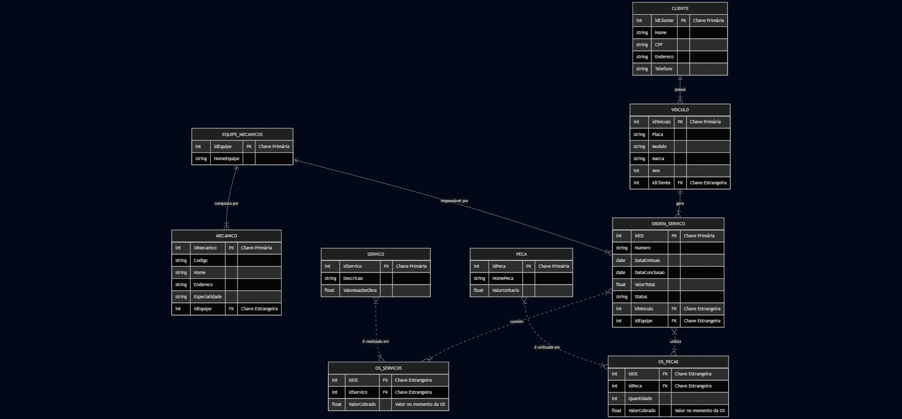

# Desafio de Projeto: Esquema Conceitual para Oficina Mecânica

Projeto desenvolvido para o Desafio de Modelagem de Banco de Dados da [Digital Innovation One](https://www.dio.me/).

## Contexto
O objetivo foi criar um esquema de banco de dados conceitual para um sistema de controle e gerenciamento de execução de ordens de serviço em uma oficina mecânica, com base na seguinte narrativa:

> *Sistema de controle e gerenciamento de execução de ordens de serviço em uma oficina mecânica.*
> *Clientes levam veículos à oficina mecânica para serem consertados ou para passarem por revisões periódicas.*
> *Cada veículo é designado a uma equipe de mecânicos que identifica os serviços a serem executados e preenche uma OS com data de entrega.*
> *A partir da OS, calcula-se o valor de cada serviço, consultando-se uma tabela de referência de mão-de-obra.*
> *O valor de cada peça também irá compor a OS.*
> *O cliente autoriza a execução dos serviços.*
> *A mesma equipe avalia e executa os serviços.*
> *Os mecânicos possuem código, nome, endereço e especialidade.*
> *Cada OS possui: n°, data de emissão, um valor, status e uma data para conclusão dos trabalhos.*

---

## Esquema Conceitual

Abaixo está o diagrama do esquema conceitual desenvolvido para atender aos requisitos da narrativa.

**-- ATENÇÃO: Substitua "NOME_DA_SUA_IMAGEM.png" pelo nome exato do arquivo que você subiu! --**

---

## Decisões de Projeto e Suposições

Como a narrativa é um resumo, algumas decisões foram tomadas para criar um modelo mais completo e coerente:

* **Entidade Cliente:** Foram adicionados atributos básicos como `CPF`, `Endereço` e `Telefone` para um cadastro mínimo de cliente.
* **Relacionamento Cliente-Veículo:** Assumi que um veículo pertence a apenas um cliente para simplificar o modelo (1:N).
* **Relacionamento OS-Serviços e OS-Peças:** Foi identificado que uma Ordem de Serviço pode conter múltiplos serviços e peças. Da mesma forma, um mesmo tipo de serviço ou peça pode estar em várias OS. Por isso, foram criadas as tabelas associativas `OS_Servicos` e `OS_Pecas` para representar corretamente estes relacionamentos **Muitos-para-Muitos (N:M)**.
* **Preços:** Assumi que o valor da mão de obra e das peças é registrado nas tabelas associativas no momento da criação da OS. Isso garante que, mesmo que o preço mude no futuro, o valor cobrado naquela OS específica fique registrado corretamente.
